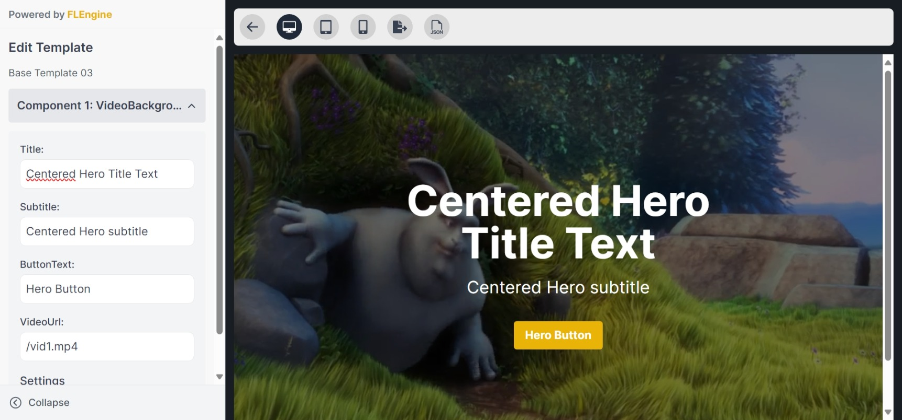
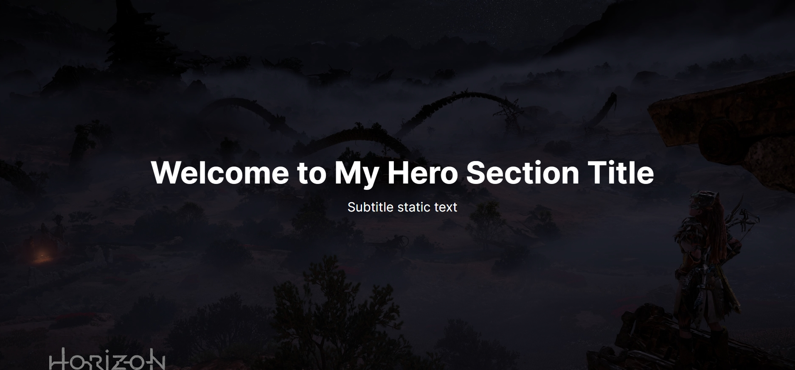

# **Static Templating Engine**

This project is a static templating engine designed for simplicity and accessibility. It allows users, especially students, to easily edit content and host their online portfolios on platforms like GitHub Pages without requiring backend servers. Built with **React**, **Vite**, and **Tailwind CSS**, it combines a sleek user interface with powerful template management capabilities.

---

## **Features**

- 🛠️ **Customizable Templates:** Manage and edit pre-built templates dynamically.
- 🌐 **Static Hosting Ready:** Perfect for hosting on platforms like GitHub Pages.
- 🎨 **Responsive Design:** Built with a dark-themed aesthetic using Tailwind CSS.
- ⚙️ **Powered by FLEngine:** The template engine ensures easy editing and configuration.

---

## **Screenshots**

### **Editor in Action**



### **Live Preview**



---

## **Getting Started**

### **Prerequisites**

- **Node.js** (>=16.x recommended)
- **Yarn** (or npm)

### **Installation**

1. Clone the repository:

   ```bash
   https://github.com/lewis-2000/FLWeb.git
   cd FLWeb

   ```

2. Install Dependencies:

````bash
  yarn install
  #or with npm
  npm install

3. Running the Development Server:
```bash
yarn dev
# Or with npm
npm run dev

4. Building for Production:
```bash
yarn dev
# Or with npm
npm run dev

````
